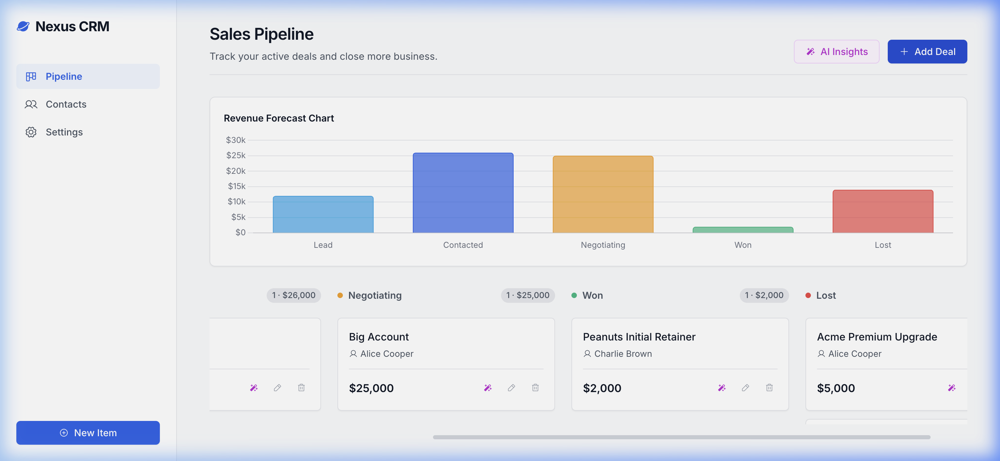
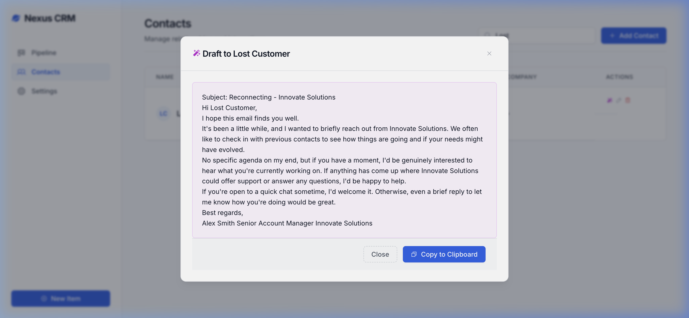
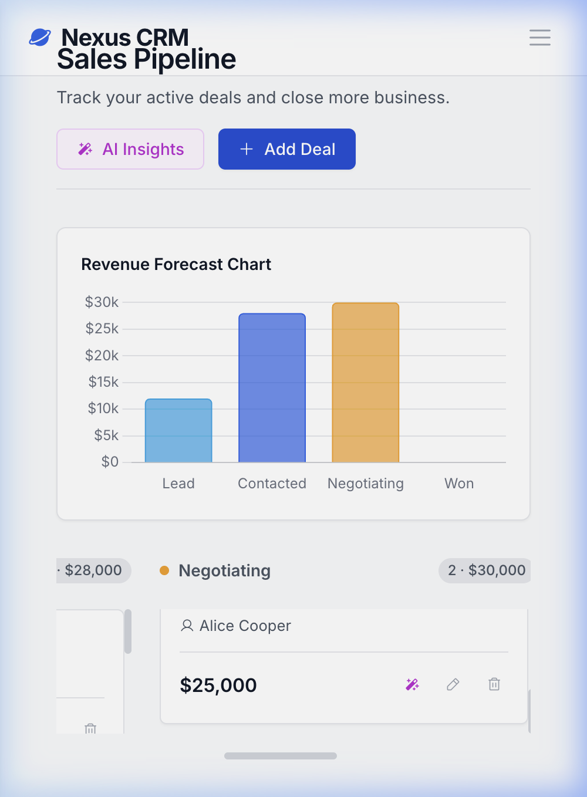

# Nexus CRM Prototype

Nexus CRM is a sophisticated, minimalist, and blazing-fast client-side web application designed for small businesses that need a powerful CRM without the bloat of an enterprise system. 

It operates entirely without a backend server—all data is maintained directly in your browser using standard APIs and represented internally as JSON.

## Key Features

- **Client-Side Storage**: Leverages the browser's `localStorage` to persist Contacts and Deals without needing a backend server or database infrastructure. Data can be exported to or imported from a JSON file.
- **Full Deal & Contact CRUD**: Create, Read, Update, and Delete both Contacts and Pipeline Deals via slick modal interfaces. The system properly hydrates existing data for rapid inline editing.
- **Sales Pipeline Management**: A visual Kanban board drag-and-drop interface for managing Deals across different stages (Lead -> Contacted -> Negotiating -> Won).
- **Revenue Forecasting**: Calculates real-time total pipeline value natively and visualizes it using a responsive, animated Chart.js bar chart.
- **Generative AI Integration**: Incorporates the Google Gemini API to automatically draft personalized outreach emails for Contacts, and generate strategic insights for active Deals based on their metadata.

## How to Run

Because this is a vanilla HTML/CSS/JS application, no build steps are required.

1. Clone this repository to your local machine.
2. Serve the directory using any local web server. For example, using Node.js:
   ```bash
   npx serve .
   ```
3. Navigate to `http://localhost:3000` (or whichever port your server uses) in your web browser.

## Screenshots

**Sales Pipeline Dashboard**


**AI Email Assistant**


**Mobile Responsiveness**


## E2E Testing Plan & Results

The complete CRM has been rigorously tested using automated browser agents acting as a Sales Persona.

### Test Scenarios Passed
1. **Mobile Responsiveness Test**
   - Resized viewport to 400x800. verified the navigation `.sidebar` successfully collapses into a hamburger menu.
   - Tested adding new Contacts and Deals from a mobile viewport, including injecting detailed text into the `Notes` element.
   - Verified that the main Revenue Forecast Chart renders accurately on constrained mobile displays.
2. **Desktop System Verification**
   - Tested tracking a Deal transitioning into the `Lost` stage. Verified the Chart.js visualizer automatically aggregates the lost values and dynamically renders the `Lost` bar in red to maintain full visibility of pipeline failure rates.
   - Operated the `AI Assistant` directly from the Pipeline View to quickly draft an email reconnecting with the lost customer, asserting the Generative AI accurately parses contextual information.

## 🛑 License & Terms of Use

This software is a proprietary prototype. All rights are reserved by the author.

By accessing or using this repository, you agree to the following:

- **Usage**: You are granted a limited, non-exclusive license to run and evaluate this software for personal or testing purposes only.
- **No Modifications**: You may not modify, adapt, transform, or build upon this source code.
- **Non-Commercial**: You may not use this software, its source code, or its outputs for any commercial purposes or to generate revenue.
- **No Redistribution**: You may not redistribute or "fork" this code with the intent of creating a derivative work without express written permission.
